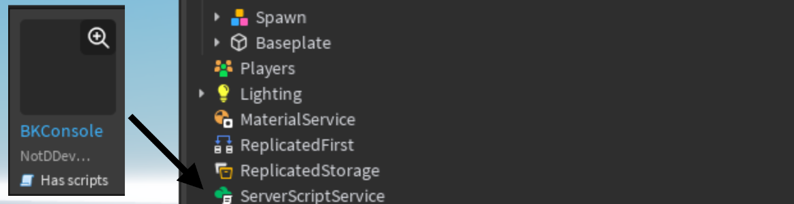

# Introduction

### What is BKConsole?

BKConsole is a lightweight and customizable command bar module designed for quick and efficient command execution through an  interface. It allows you to run commands easily and create your own custom commands

## Features

- Lightweight and easy to integrate
- Custom command support
- Argument parsing with type checking
- Autocompletion and descriptions

## Installation

You can install BKConsole from [this link](https://create.roblox.com/store/asset/85043397010930)

After downloading, drag the 'Packages' folder into your project workspace.
If necessary, you can rename the folder.

{ align=left }

!!! info
    - Make sure you put BKConsole under ServerScriptService.
    - Do not unpack the folder.